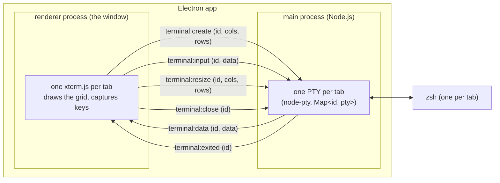
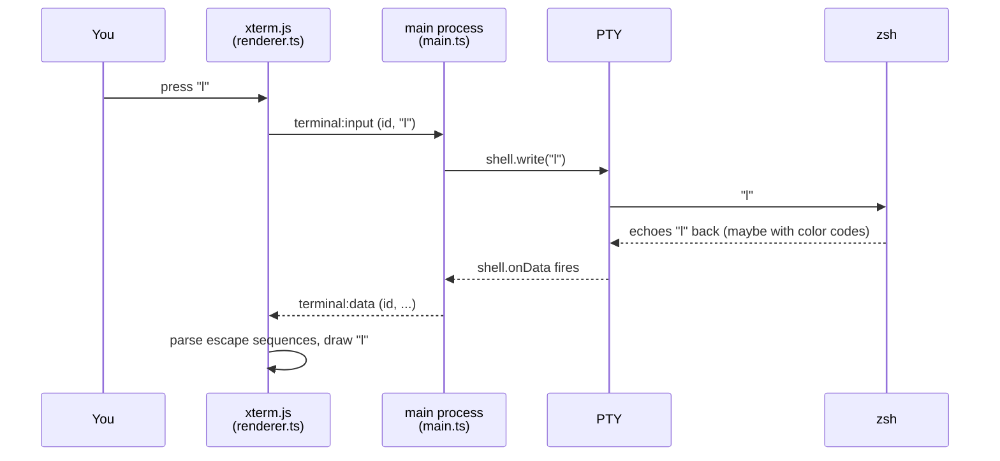

# editor-terminal

A minimal terminal emulator for macOS, built with [Electron](https://www.electronjs.org/)
and [xterm.js](https://xtermjs.org/) as a learning project. Unfamiliar terms are
defined in [GLOSSARY.md](GLOSSARY.md).

## Run it

```sh
npm install
npm run rebuild   # recompile node-pty for Electron (see "Native module" in the glossary)
npm start         # type-checks + compiles src/ to dist/, then launches
```

`npm run check` type-checks without launching.

## How it works

The app is two processes. Each tab pairs one xterm.js instance (renderer)
with one shell in a PTY (main); every IPC message carries the tab's session
id so the two sides stay paired:



All arrows between the processes pass through `window.terminal`, the bridge
that `preload.cts` exposes to the page. (Two further main → renderer events,
`tab:new` and `tab:close`, forward the ⌘T/⌘W menu items — see "Menu
accelerator" in the glossary.)

Life of a keystroke — you press `l`:



The character you see is drawn in the *last* step, not the first — like the
original hardware terminals, nothing appears on screen until the program on
the other end echoes it back.

## Files

| File              | Role                                                              |
| ----------------- | ----------------------------------------------------------------- |
| `src/api.ts`      | **The public interface**: every Command in, every Event out       |
| `src/main.ts`     | Main process: opens the window, spawns zsh in a PTY, relays bytes |
| `src/preload.cts` | Security bridge: exposes `window.terminal`, nothing else          |
| `src/renderer.ts` | Owns the tabs; wires each xterm.js instance to `window.terminal`  |
| `src/theme.ts`    | All visual settings (colors, font) in one importable place        |
| `src/bridge.ts`   | The IPC contract as a type, shared by preload and renderer        |
| `src/index.html`  | The page: one `<div>`, xterm's CSS/JS via script tags             |
| `tsconfig.json`   | Compiler settings; `tsc` emits `src/*.ts` → `dist/*.js` 1:1       |

There is deliberately no bundler, no framework, and no abstraction for
features we don't have yet. Features get added when we need them.

## Driving the editor

Everything the editor can do is a Command, and everything that happens is
an Event — the unions in [src/api.ts](src/api.ts) are the whole public
interface, and the UI itself is just its first client. Try it from the
devtools console (⌥⌘I):

```js
editor.command({ type: "new-tab" })
editor.command({ type: "write", text: "ls\n" })
editor.command({ type: "close-tab" })
```

The endgame (see ARCHITECTURE.md, "The command bus") is a local server in
the main process feeding the same bus, so an agent can fully drive the
editor.
# editor
