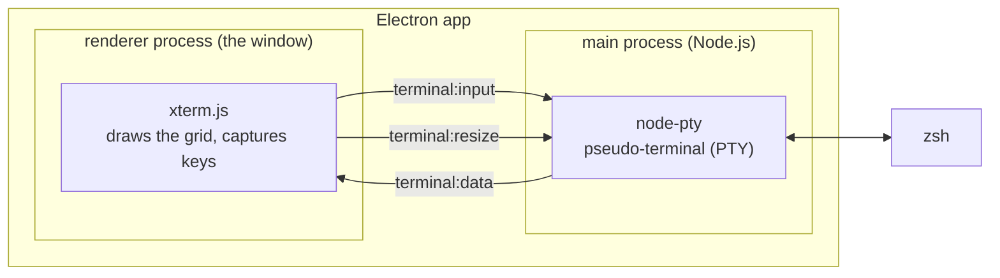
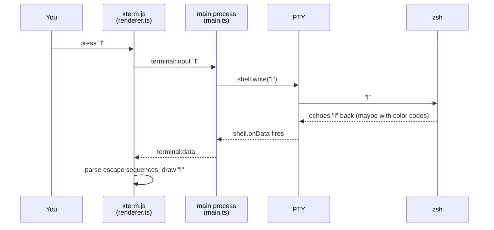

# editor-terminal

A minimal terminal emulator for macOS, built with [Electron](https://www.electronjs.org/)
and [xterm.js](https://xtermjs.org/) as a learning project. Unfamiliar terms are
defined in [GLOSSARY.md](GLOSSARY.md).

## Run it

```sh
npm install
npm run rebuild   # recompile node-pty for Electron (see "Native module" in the glossary)
npm start         # type-checks + compiles src/ to dist/, then launches
```

`npm run check` type-checks without launching.

## How it works

The app is two processes connected by three IPC messages:



All three arrows between the processes pass through `window.terminal`, the
three-function bridge that `preload.cts` exposes to the page.

Life of a keystroke — you press `l`:



The character you see is drawn in the *last* step, not the first — like the
original hardware terminals, nothing appears on screen until the program on
the other end echoes it back.

## Files

| File              | Role                                                              |
| ----------------- | ----------------------------------------------------------------- |
| `src/main.ts`     | Main process: opens the window, spawns zsh in a PTY, relays bytes |
| `src/preload.cts` | Security bridge: exposes exactly 3 functions as `window.terminal` |
| `src/renderer.ts` | Sets up xterm.js and wires it to `window.terminal`                |
| `src/theme.ts`    | All visual settings (colors, font) in one importable place        |
| `src/bridge.d.ts` | The IPC contract as a type, shared by preload and renderer        |
| `src/index.html`  | The page: one `<div>`, xterm's CSS/JS via script tags             |
| `tsconfig.json`   | Compiler settings; `tsc` emits `src/*.ts` → `dist/*.js` 1:1       |

There is deliberately no bundler, no framework, and no abstraction for
features we don't have yet. Features get added when we need them.
# editor
