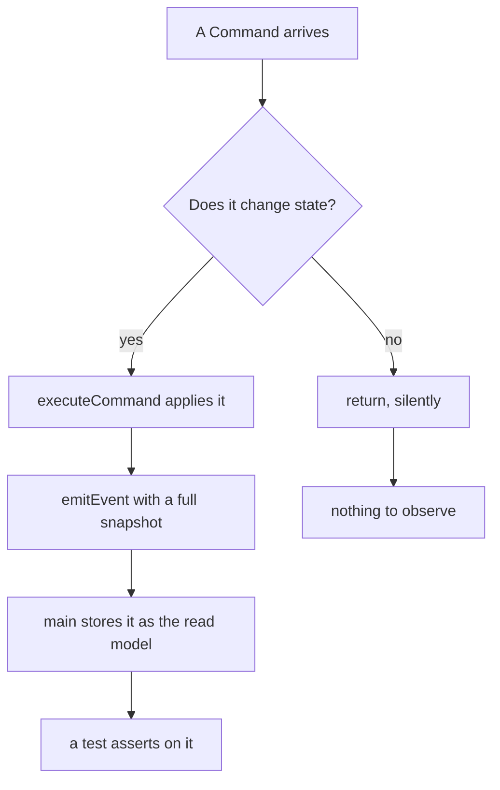

# A document with a diagram in it

This file exists so a test can scroll a rendered document to its bottom and
reload it. It needs three things: a mermaid fence, because those are drawn
long after the text lands and change the document's height when they do;
enough prose after the diagram that the bottom is well below the first
screenful; and nothing that changes between runs.

## The diagram

## Filler, so that there is somewhere to scroll to

A terminal emulator is two halves joined by a cable. The screen half draws
cells and turns keystrokes into bytes. The computer half runs a program that
does not know it is talking to a screen at all.

Everything below this line is here for its height. It is ordinary prose so
that the rendered document reflows the way a real one does, and so that a
change in font settings would move the bottom rather than leaving it
suspiciously fixed.

The pseudoterminal sits between the two. It is a pair of file descriptors
that pretends to be a serial line: one end handed to the shell, the other
held by the program drawing the screen.

Escape sequences are how the computer half says anything other than "print
this character". Move the cursor. Clear to the end of the line. Set the
window title. They are ordinary bytes with an ordinary meaning that happens
to be structural rather than textual.

A shell prints a prompt, waits for a line, forks, and waits again. The loop
is old enough to vote several times over, and nothing about it has needed to
change.

Scrollback belongs to the screen half. The computer half has no idea what
has scrolled past, which is why a reconnected session cannot show you what
you missed, and why restoring a session cannot restore what was on screen.

Line discipline is the layer that makes backspace work before any program
has read a byte. It buffers a line, handles erase and kill characters, and
hands the finished line over.

Window size is a property the kernel keeps and a signal it delivers. Resize
the window and the program learns about it through SIGWINCH, asks for the
new size, and redraws. That is the whole mechanism.

Colors arrived as eight, then sixteen, then two hundred and fifty six, and
finally as twenty four bit values written in the same escape sequence shape
as everything else. Each generation left the previous one working.

A control sequence that a terminal does not recognize is skipped rather than
printed, which is why a program written for a fancier terminal degrades into
something readable rather than something garbled.

The alternate screen buffer is why a full screen program can exit and leave
your prompt exactly as it was. It draws on a second buffer and hands the
first one back untouched on the way out.

Bracketed paste tells a program that the bytes arriving next were pasted
rather than typed, so an editor can insert them literally instead of
interpreting every one as a command.

Flow control with XON and XOFF is a fossil of the days when the screen could
genuinely be outrun by the computer, and it still turns up as the reason a
terminal appears to freeze after an accidental Ctrl+S.

That is enough prose. The bottom of this document is now far enough from the
top that restoring a scroll position is a claim worth checking.
